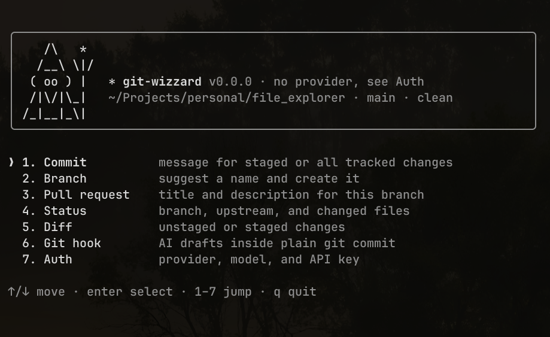

# git-wizzard

AI-assisted git from your terminal: write commit messages and name branches from your actual changes, using OpenAI, Google Gemini, Anthropic Claude, or any OpenAI-compatible server, including a local model in Ollama that keeps your code on your machine.



```console
$ git add -A
$ gitwizz commit

Commit message:
feat(auth): resolve provider credentials lazily

Git-only commands no longer require an API key.

[c]onfirm / [e]dit / [a]bort: c
Created commit 3f9a1c2e on main: feat(auth): resolve provider credentials lazily
```

`status` and `diff` work without any setup. Only `commit`, `branch`, and `pr` call a model.

## Requirements

- Node.js 22 or newer
- git
- An OpenAI, Gemini, or Anthropic API key, or an OpenAI-compatible server such as Ollama (for `commit`, `branch`, and `pr`)

## Install

From source:

```sh
git clone https://github.com/sadexx/git-wizzard.git
cd git-wizzard
npm ci
npm run build
cd packages/cli && npm link   # puts `gitwizz` on your PATH
```

## Quick start

```sh
gitwizz auth      # pick a provider, enter an API key (validated, then saved)
git add <files>
gitwizz commit    # generate a message from the staged diff, then confirm/edit/abort
```

Run `gitwizz` with no arguments for the interactive menu.

## Commands

| Command | What it does |
| --- | --- |
| `gitwizz` | Interactive UI with the same options as the commands: commit (staged or all tracked, hint, edit in your git editor, regenerate, and **Choose files…** to tick files in or out of the index with `space`, new files included), push (after a confirmation; a new branch gets its upstream set on `origin`, and it never force-pushes, also offered after a commit), branch (type, hint, your own name), pull request (base, hint, and **Open PR…**, which runs `gh pr create` with the title and body after a confirmation, pushing the branch first if needed; needs the [GitHub CLI](https://cli.github.com), logged in), status, a scrollable diff, the git hook, and auth (set up, change model, status, log out). The header shows the provider and model in use. Keys: ↑/↓ or number keys to pick, `enter` choose, `esc` back, `q` quit. |
| `gitwizz status` | Current branch, upstream, ahead/behind, and changed files. |
| `gitwizz diff [--staged]` | Unstaged (default) or staged changes with per-file line counts. |
| `gitwizz commit [-a] [--hint <text>] [-y \| --dry-run]` | Generate a commit message from **staged** changes (with `-a`, all changes to tracked files, like `git commit -a`; nothing is staged unless you confirm) in the style of your recent commits (falling back to Conventional Commits), then confirm, edit, regenerate, or abort before committing. |
| `gitwizz branch [--type <type>] [--hint <text>] [-y \| --dry-run]` | Suggest branch names for **all uncommitted work** (staged, unstaged, and new files) and create/switch to the one you confirm. `<type>` is one of `feature`, `fix`, `chore`, `refactor`, `docs`, `test`, `hotfix`. |
| `gitwizz pr [--base <branch>] [--hint <text>]` | Write a pull request title and Markdown description from the commits on this branch that aren't on `<branch>` (default: origin's default branch, else `origin/main`, `origin/master`, `main`, `master`). Prints to stdout; changes nothing. Uncommitted work isn't included. |
| `gitwizz hook install` / `uninstall` | Add (or remove) a `prepare-commit-msg` hook so a plain `git commit` opens the editor with an AI draft. |
| `gitwizz auth [--no-validate]` | Choose a provider (for **Custom**, a server URL), enter an API key, pick a model, and save it. In the interactive UI the model is picked from the list the provider reports (type to filter; any name you type works too). |
| `gitwizz auth status` | Show the provider, model, masked key, and source (environment or saved config) that the AI commands will use. Exits 1 when nothing is set up. No network. |
| `gitwizz auth model <name>` | Change the model of the saved setup, keeping its API key. No re-authentication, no network. |
| `gitwizz auth logout` | Delete the saved credentials. Environment variables are not affected. |

Every command acts on the repository in the current directory. `--help` works on the program and on each command. Output is colored in a terminal and plain when piped; set `NO_COLOR=1` to turn colors off. While the model works, a spinner with elapsed seconds shows on stderr (terminal only).

A diff shows *what* changed, not *why*. Pass `--hint` to tell the model the intent, for example `gitwizz commit --hint "retry on 429 from the payments API"` (up to 500 characters).

When confirming, **regenerate** asks the model for a fresh proposal (a failed retry keeps the current one). **Edit** opens the same editor git uses (`GIT_EDITOR`, `core.editor`, `VISUAL`, `EDITOR`). Lines starting with `#` are ignored, and saving an empty text keeps the previous one. If the editor can't be used, you get a one-line prompt instead. `Ctrl-C` or `Ctrl-D` at the prompt aborts.

### Git hook

`gitwizz hook install` lets you keep using plain `git`: every `git commit` that would open the editor starts with a generated draft above git's usual comments (works with `git commit -a` and `git commit <paths>` too). Commits with `-m`/`-F`, `--amend`, merges, and squashes keep their own message. If generation fails (no credentials, network down), git's normal empty message appears and the commit is never blocked.

The hook is installed in the current repository (respecting `core.hooksPath`) and calls gitwizz at the path it was installed from; rerun `hook install` if you move it. An existing hook that git-wizzard didn't write is never overwritten or removed.

### Scripting

`commit` and `branch` ask for confirmation, so without a terminal they stop with an error instead of waiting. Choose explicitly:

- `-y, --yes`: accept the generated message (or the first branch suggestion) without asking.
- `--dry-run`: print only the result to stdout and change nothing.

```sh
gitwizz commit --dry-run                    # just the message
git commit -e -m "$(gitwizz commit --dry-run)" # review it in git's own editor
gitwizz branch --dry-run | head -n1         # best branch name
gitwizz pr > pr.md && gh pr create --title "$(head -n1 pr.md)" --body "$(tail -n +3 pr.md)"
```

`pr` prints only the description to stdout (title, blank line, body); the "Describing N commits not on <base>" note goes to stderr.

## Configuration

Credentials come from the first source that provides them:

1. **Environment** (never written to disk)
   - `OPENAI_API_KEY`: use OpenAI
   - `GEMINI_API_KEY` or `GOOGLE_API_KEY`: use Gemini
   - `ANTHROPIC_API_KEY`: use Claude
   - `GIT_WIZZARD_PROVIDER`: `openai`, `gemini`, or `anthropic`; required to choose when more than one key is set (`custom` defers to the saved setup)
   - `GIT_WIZZARD_MODEL`: override the model used with the key above
2. **Saved config** at `~/.git-wizzard/config.json`, written by `gitwizz auth` with `0600` permissions. The **Custom (OpenAI-compatible)** provider is set up only this way: a server URL (e.g. `http://localhost:11434/v1` for Ollama, or a gateway), an optional API key, and a model.

Run `gitwizz auth status` to see which source wins.

Default models: `gpt-5.4-mini` (OpenAI), `gemini-3.6-flash` (Gemini), and `claude-opus-5-5` (Claude). With Claude, a request the model's safety checks decline is retried on another Claude model Anthropic picks (server-side fallback) on the models that support it.

> **Privacy:** `commit`, `branch`, and `pr` send the changed file names and the diff to your chosen provider. The diff is capped at about 6,000 characters, shared across files so one large file can't hide the rest; lockfiles and minified or source-map files are named but their diffs are left out. `commit` also sends the current branch name and the subjects of your last 10 commits so it can match your style; `pr` sends the branch names and the messages of the commits it describes. `status` and `diff` never leave your machine. With the Custom provider pointed at a local server such as Ollama, nothing leaves your machine at all.

## How it works

The project is an npm workspace with three packages:

- **`packages/server`** is an [MCP](https://modelcontextprotocol.io) server that exposes git tools (`get_status`, `get_diff`, `suggest_branch_name`, `generate_commit_message`, `generate_pr_description`, `create_commit`, `create_branch`, `stage_files`, `push`, `create_pull_request`). It never holds API keys. When it needs text generated, it asks the client via MCP *sampling*.
- **`packages/cli`** is the `gitwizz` command. It starts the server as a subprocess and answers sampling requests with your configured provider. Credentials are resolved only when a tool actually samples.
- **`packages/shared`** holds the schemas, the `Result` type, and typed errors used by both sides.

Because the server is a standard MCP server, any MCP client that supports sampling can use its tools directly:

```sh
npm run inspect -w packages/server   # open it in the MCP Inspector
```

## Development

```sh
npm ci
npm run build   # builds shared → server → cli
npm test        # builds and runs every package's tests (node:test)
```

Tests are colocated with sources as `*.test.ts` and run from the compiled `dist/`.
